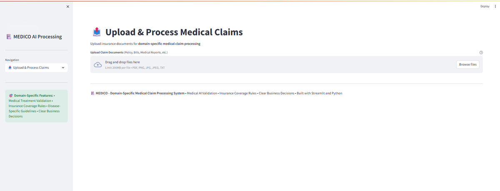
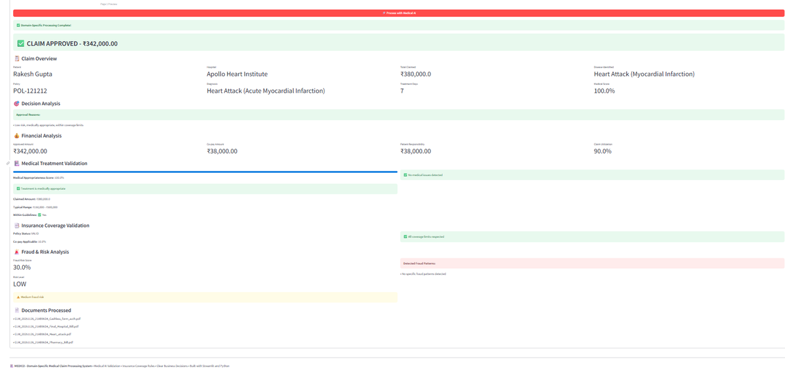
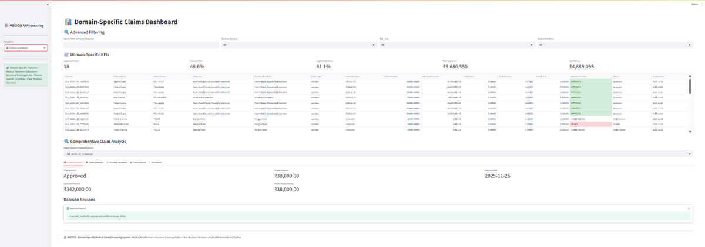

#  **AI-Powered Medical Claim Processing System | Python, ML & NLP**

An end-to-end system that ingests raw medical claim PDFs, extracts key information, validates fields, performs heuristic + LLM-based checks, scores claims, stores them in a database, and generates PDF summary reports.

---

# 🧭 **Table of Contents**

* <a href="#overview">Overview</a>
* <a href="#problem-statement">Problem Statement</a>
* <a href="#dataset">Dataset</a>
* <a href="#tools--technologies">Tools & Technologies</a>
* <a href="#project-structure">Project Structure</a>
* <a href="#methods">Methods</a>
* <a href="#key-insights">Key Insights</a>
* <a href="#ui-overview">User Interface (UI Overview)</a>
* <a href="#model--dashboard--output">Model / Dashboard / Output</a>
* <a href="#how-to-run-this-project">How to Run This Project</a>
* <a href="#results--conclusion">Results & Conclusion</a>
* <a href="#future-work">Future Work</a>
* <a href="#author--contact">Author & Contact</a>

---

# <a id="overview"></a> **Overview**

This project demonstrates a **Proof of Concept (POC)** for automating end-to-end medical claim processing.
The system:

* Accepts raw claim PDFs
* Extracts fields using heuristic rules + LLM-based extraction (Mistral 7B via Ollama)
* Validates medical fields
* Performs anomaly & fraud checks
* Stores processed results in SQLite (`claims.db`)
* Generates comprehensive PDF summary reports
* Provides a Streamlit UI for interactive processing & dashboards

This architecture mimics real-world health insurance workflows.

---

# <a id="problem-statement"></a> **Problem Statement**

Traditional claim processing is:

* Manual
* Time-consuming
* Error-prone
* Difficult to scale
* Vulnerable to fraud

The goal is to build an automated AI-assisted pipeline that reduces manual effort, improves transparency, and enables faster decision-making.

---

# <a id="dataset"></a> **Dataset**

This repository **does not** include any real medical data or PHI.

### **Data Flow**

Users upload raw PDFs into:

```
data/raw_claims/<claim_id>/
```

Each claim typically contains **3–5 PDF documents** (invoice, lab report, discharge summary, treatment plan, etc.)

The system automatically creates:

```
database/claims.db
```

### Important Notes

* `claims.db` is automatically generated when the system runs.
* For enterprise deployments → replace SQLite with **PostgreSQL / Azure SQL / AWS RDS**.

---

# <a id="tools--technologies"></a> **Tools & Technologies**

### **Languages & Frameworks**

* Python
* Streamlit (UI)

### **AI & Machine Learning**

* Heuristic scoring
* LLM extractors (Ollama, Mistral 7B)
* XGBoost (future)

### **Data Processing**

* Pandas, NumPy
* PyPDF2
* Regex parsers

### **Persistence**

* SQLite (`claims.db`)
* Optional: PostgreSQL

### **PDF Generation**

* ReportLab
* pdfkit / wkhtmltopdf

### **Utilities**

* python-dotenv
* pathlib
* logging

---

# <a id="project-structure"></a> **Project Structure**

```
ai-medical-claim-processing-system-python-ml/
│
├── app/
│   └── streamlit_app.py                  
│
├── data/
│   └── raw_claims/             # user-uploaded claim PDFs
│
├── database/
│   └── claims.db               # auto-generated SQLite DB
│
├── scripts/
│   ├── data_collector.py
│   ├── text_extractor.py
│   ├── ai_validator.py
│   ├── claim_analyzer.py
│   ├── model_trainer.py        # (future XGBoost)
│   ├── report_generator.py
│   └── main_processing_pipeline.py
│
├── models/                     # ML models (empty for now)
│
├── reports/                    # output PDF summaries
│
├── images/                     # screenshots for README
│
├── README.md
└── requirements.txt
```

---

# <a id="methods"></a> **Methods**

### **1. PDF Ingestion**

* Reads multiple PDFs per claim
* Extracts text
* OCR optional

### **2. Information Extraction**

* Regex + heuristics
* LLM-based extraction
* Code normalization (diagnosis/procedure codes)

### **3. Validation**

* Missing field checks
* ICD/CPT validation
* Financial logic checks
* Date & provider consistency

### **4. Scoring**

* Heuristic scoring
* Rule-based fraud detection
* ML model planned (XGBoost)

### **5. Report Generation**

* Structured medical summary
* Financial + medical + risk breakdown
* Saved under `reports/`

---

# <a id="key-insights"></a> **Key Insights**

* Hybrid LLM + heuristic extraction dramatically improves accuracy.
* Automatic PDF summaries help with compliance & auditing.
* Modular script-based design allows easy scaling & integration.

---

# <a id="ui-overview"></a> **User Interface (UI Overview)**


### **1. Upload & Process Medical Claims**

<a href="images/ui_upload.png">
  
</a>

---

### **2. Claims Dashboard (KPIs + Filtering + Status Table)**

<a href="images/ui_dashboard.png">
  
</a>

---

### **3. Comprehensive Claim Analysis**

<a href="images/ui_claim_analysis.png">
  
</a>

---

###  **Full UI Screenshot Gallery**

For additional UI screens (File Preview, Human Review Queue):
➡️ **`/docs/ui-gallery/`**

---

# <a id="model--dashboard--output"></a> **Model / Dashboard / Output**

## **Comprehensive Medical Claim Report (PDF Output)**

Each processed claim generates a report such as:

`reports/CLM_20251125_5CF2D11A_comprehensive_report.pdf`

### **Report Contains:**

* Executive summary
* Final decision
* Financial analysis
* Medical validation
* Coverage validation
* Fraud & risk scoring
* Document list
* Recommendations

### **Naming Convention**

```
reports/CLM_<YYYYMMDD>_<HEX>_comprehensive_report.pdf
```

---

# <a id="how-to-run-this-project"></a> **How to Run This Project**

```bash
# 1. Clone repo
git clone https://github.com/<your-username>/ai-medical-claim-processing-system-python-ml
cd ai-medical-claim-processing-system-python-ml

# 2. Create virtual environment
python -m venv kk
kk\Scripts\activate    # Windows
source kk/bin/activate # Mac/Linux

# 3. Install dependencies
pip install -r requirements.txt

# 4. Add claim PDFs
# Place files inside:
data/raw_claims/<claim_id>/

# 5. Optional: Run Streamlit
streamlit run app/streamlit_app.py
```

---

# <a id="results--conclusion"></a> **Results & Conclusion**

* Fully automated claim ingestion → extraction → validation → scoring → summary.
* LLM + heuristics significantly boost extraction accuracy.
* Database-backed architecture is scalable and production-ready.
* Ideal as an insurance POC or enterprise prototype.

---

# <a id="future-work"></a> **Future Work**

* Full ML model training (XGBoost)
* Advanced fraud detection
* Real-time API endpoints
* Batch processing
* Postgres migration
* Docker containerization
* Cloud deployment

---

# <a id="author--contact"></a> **Author & Contact**

**Digvijay Rengade**
📧 [digvijayrengade9673@gmail.com]
🔗 LinkedIn: [https://www.linkedin.com/in/digvijayrengade99]
---

